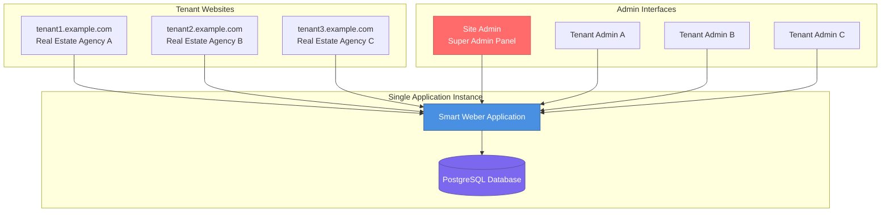
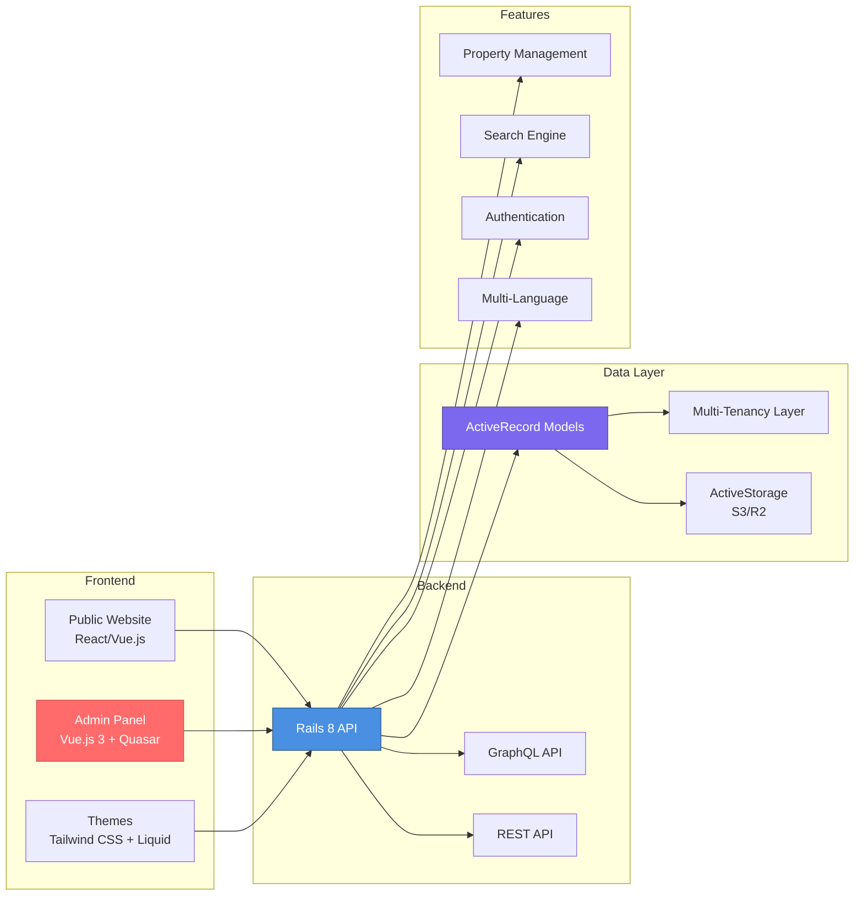
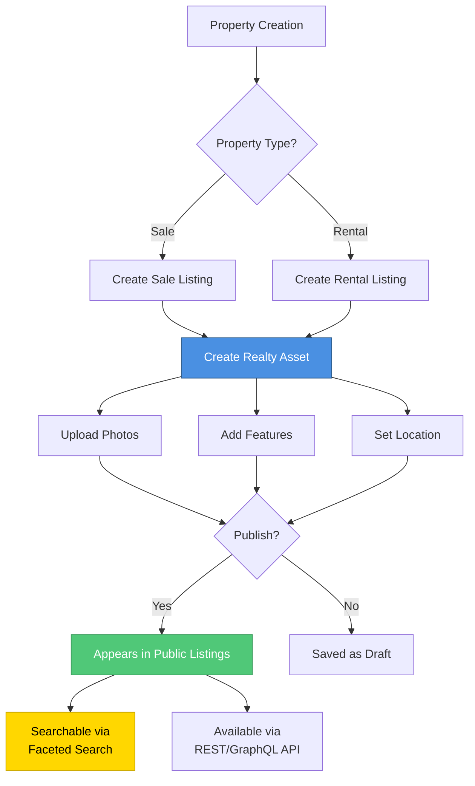

# Smart Weber

**Author:** Elias Winberg

## Description

Smart Weber is a modern, multi-tenant real estate web platform built with Rails 8 and Ruby 3.4.7. It enables real estate agencies to quickly create and manage professional property listing websites with comprehensive features including property search, multi-language support, customizable themes, and powerful admin interfaces.

Key features include:

- **Multi-Tenancy** - Host multiple real estate websites from a single installation using subdomain-based tenant separation
- **Property Management** - Complete system for managing sale and rental listings with photos, features, and detailed property information
- **Admin Panels** - Dual admin interfaces: site admin (super admin) and tenant admin (per-tenant management)
- **Themes** - Customizable themes (Brisbane, Bologna, Bristol, and more) with Tailwind CSS and Liquid templates
- **Multi-Language Support** - Built-in support for multiple languages using the Mobility gem
- **Advanced Search** - Faceted search functionality with field filtering for properties
- **SEO Optimized** - Comprehensive SEO implementation for better search engine visibility
- **Responsive Design** - Mobile-friendly layouts that work across all devices
- **RESTful API** - Public API for property listings and website content
- **GraphQL Support** - Modern GraphQL API for flexible data queries

## Architecture

### Multi-Tenancy Architecture

Smart Weber uses subdomain-based multi-tenancy to host multiple real estate websites from a single installation:



### System Components



### Property Management Flow



## Usage

### Prerequisites

- Ruby 3.4.7 or higher
- Rails 8.0 or higher
- PostgreSQL database
- Node.js and npm (for frontend assets)

### Installation

1. Clone the repository:
```bash
git clone <repository-url>
cd property_web_builder
```

2. Install dependencies:
```bash
bundle install
npm install
```

3. Setup the database:
```bash
bin/rails db:create
bin/rails db:migrate
```

4. Seed the database with sample data:
```bash
bundle exec rake pwb:db:seed
```

Alternatively, use the setup script which does all of the above:
```bash
bin/setup
```

### Running the Application

Start the development server:
```bash
bin/dev
```

This will start both the Rails server and the Vite frontend build process. Access the application at `http://localhost:3000`.

### Creating a Website/Tenant

The application uses subdomain-based multi-tenancy. After seeding, you can access the default website or create new tenants through the admin interface.

### Admin Access

After seeding, an admin user is created with:
- Email: `admin@<subdomain>.com`
- Password: `password`

Access the admin panel at `/site_admin` after logging in.

### Database Seeding Options

To seed without sample properties:
```bash
SKIP_PROPERTIES=true bundle exec rake pwb:db:seed
```

For detailed development instructions, including setup, testing, and troubleshooting, please refer to [DEVELOPMENT.md](DEVELOPMENT.md).
